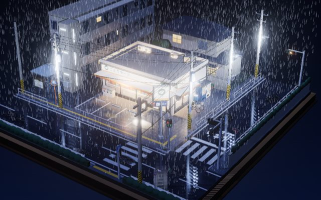
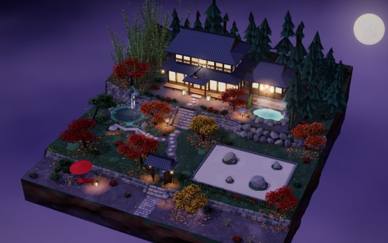

# 3D 微縮場景

用 three.js 手工建模的日式微縮場景集，預設是夜景，也可以切換晴、雨、雪，或把時間拖到清晨、正午、黃昏。所有模型、貼圖和動畫都由程式產生，沒有外部模型檔；也不需要建置步驟或安裝套件，開一個本機伺服器就能看。

**線上版：https://wkai2573.github.io/3d-miniature-scenes/**

| 雨夜のことりマート | 秋夜の紅葉屋 |
|---|---|
|  |  |

## 場景

| 場景 | 頁面 | 風格 | 內容 |
|---|---|---|---|
| 雨夜のことりマート | `index.html` | 三渲二（toon 著色＋描邊） | 深夜下雨的街角便利商店。雨絲與地面水花、帶雨痕的玻璃、濕路面倒影、依週期輪替的紅綠燈，店內有貨架、關東煮和咖啡機 |
| 秋夜の紅葉屋 | `ryokan.html` | 柔和低多邊形＋SSAO | 浮在晚秋夜空中的溫泉旅館浮島。後山、台地、庭園、參道四層高低差，五裂楓葉樹冠、陣風與落葉模擬、池塘倒影與漣漪、露天風呂的湯けむり、月亮與雲海 |

## 時間與天氣

畫面下方的面板可以切換天氣（晴、雨、雪），拖動時間滑桿時畫面會立刻跟著變：太陽從畫面左邊升起、劃過上方、從右邊落下，夜裡換成月亮；天空、霧、環境光與主光的顏色和方向一起改變，影子也跟著轉。

| | 雨夜のことりマート | 秋夜の紅葉屋 |
|---|---|---|
| 開場 | 23:00、雨 | 20:00、晴 |
| 天亮時 | 路燈、公寓的窗燈與走廊燈熄滅，便利商店照常營業 | 障子、行燈、石燈籠與地上的光斑熄滅，螢火消失 |
| 雨 | 雨絲、地面水花、屋簷滴水、濕路面倒影、玻璃上的雨痕 | 雨絲（靠近燈籠時染成暖色）、池面與溫泉的雨滴波紋、露天的地面變暗 |
| 雪 | 雪花飄落，屋頂、路面、圍牆頂慢慢積雪 | 雪花隨陣風斜飄，屋頂、樹冠、庭園慢慢積雪 |

- 換天氣時雨量、雪量、雲量在幾秒內漸變。雨停後路面要半分鐘左右才會乾，屋簷也會再滴一陣子；積雪大約十幾秒積滿，雪停後慢慢融化。
- 屋簷下、店裡、樹下這些頭上有東西擋著的地方不會積雪，也不會淋濕。
- 陰雨天與雪天看不到太陽、月亮和星星，路燈也會開得比較早。

## 環境音

兩個場景都有環境音，預設開啟。瀏覽器規定要等使用者互動才能出聲，所以第一次點一下畫面（或按任何鍵）之後才會開始播放。點右上角的聲音按鈕會展開小面板，可以開關環境音、用滑桿調整音量百分比；開關與音量都會記住。

| 場景 | 鋪底（錄音） | 跟畫面同步的聲音 |
|---|---|---|
| 雨夜のことりマート | 雨聲、雨棚下的滴水與排水溝（跟著雨量）、晴朗夜裡的秋蟲 | 屋簷水滴落進水窪、自動門開關與入店鈴、招牌與路燈閃爍時的電流聲、白天遠處市街的低鳴 |
| 秋夜の紅葉屋 | 樹葉的沙沙聲、秋蟲（只在晴朗的夜裡）、雨聲（下雨時） | 陣風時枯葉被捲起、秋蟲在陣風時停下；鹿威し倒水與敲擊聲；小瀑布、湯口、蹲踞的水聲 |

聲音都放在場景裡的實際位置：拉近店門口、池塘或蹲踞，那裡的聲音會變清楚，轉動視角時左右聲道也會跟著換。錄音都是 CC0 授權，來源見 [assets/audio/CREDITS.md](assets/audio/CREDITS.md)；其餘的聲音是在瀏覽器裡即時合成的。

## 執行

需要 [Bun](https://bun.sh)（1.1 以上），以及能連到 `cdn.jsdelivr.net`（three.js）和 Google Fonts 的網路。

```sh
bun start
```

然後用瀏覽器開啟：

- 雨夜のことりマート：http://localhost:5173
- 秋夜の紅葉屋：http://localhost:5173/ryokan.html

不需要 `bun install`：伺服器是零相依的 [server.mjs](server.mjs)，three.js 由 import map 從 CDN 載入。

要換連接埠時設定 `PORT`：

```sh
PORT=8080 bun start            # macOS / Linux / Git Bash
$env:PORT=8080; bun start      # PowerShell
```

> 不能直接雙擊 HTML 檔開啟。瀏覽器不允許從 `file://` 載入 ES 模組，畫面會顯示錯誤提示。

## 部署

推送到 `main` 時，GitHub Actions（[deploy.yml](.github/workflows/deploy.yml)）會自動把網站部署到 GitHub Pages，大約一分鐘後生效。也可以在 repo 的 Actions 頁面手動執行「部署到 GitHub Pages」。

- 只會上傳 `index.html`、`ryokan.html`、`css/`、`src/`、`assets/`；`server.mjs`、`package.json` 和 README 不會出現在網站上。
- 所有路徑都是相對路徑，所以網站放在 `/3d-miniature-scenes/` 子路徑下也能正常運作。新增檔案時請不要用 `/` 開頭的絕對路徑。
- 新增場景的頁面或資料夾，如果不在上面列出的位置，要一併加進 workflow 的「整理網站檔案」步驟。

## 操作

| 動作 | 效果 |
|---|---|
| 左鍵拖曳 | 旋轉視角 |
| 滾輪、雙指縮放 | 拉近拉遠 |
| 右鍵拖曳 | 平移 |
| `M` | 開關左上角的場景選單 |
| `1`～`9` | 直接切換到第 N 個場景 |
| `↑` `↓` | 選單開啟時在卡片間移動 |
| `Esc` | 關閉選單 |
| 右上角的聲音按鈕 | 展開面板：開關環境音、調整音量（0–100%） |
| `S` | 開關環境音 |
| `−` `＋` | 音量每次調 10% |
| 下方的天氣按鈕與時間滑桿 | 切換晴、雨、雪；拖動調整時間（焦點在滑桿上時方向鍵每次 5 分鐘） |
| `W` | 依序切換晴、雨、雪 |
| `←` `→` | 時間每次調 1 小時 |

- 系統開啟「減少動態效果」時，雨絲、雪花和落葉的數量會減少，部分飄動效果停用，轉場布幕改成簡短的淡入淡出。
- 在紅葉屋的網址後面加上 `#noao`（`ryokan.html#noao`）可以關閉 SSAO，方便在較弱的顯示卡上比較效能。

## 專案結構

```
index.html              雨夜のことりマート（預設頁）
ryokan.html             秋夜の紅葉屋
server.mjs              零相依的本機靜態伺服器（Bun）
.github/workflows/      推送 main 時自動部署到 GitHub Pages
css/
  style.css             畫布、載入提示、錯誤訊息
  menu.css              場景選單、聲音按鈕與轉場布幕
assets/
  thumbs/               選單卡片縮圖（640 × 400）
  audio/                環境音錄音（來源與授權見 CREDITS.md）
src/
  boot.js               一般腳本，比模組先執行；載入失敗時把原因顯示在畫面上
  engine/               兩個場景共用的引擎
  ui/                   場景選單、轉場布幕、場景目錄
  scenes/konbini/       雨夜のことりマート
  scenes/ryokan/        秋夜の紅葉屋
```

### 共用引擎（`src/engine/`）

| 檔案 | 用途 |
|---|---|
| [renderer.js](src/engine/renderer.js) | 渲染器、相機、OrbitControls 與後製，由各場景呼叫 `setupRenderer()` 設定 |
| [context.js](src/engine/context.js) | 共用的 `scene`、時間 uniform、每格更新的登錄表 `onTick()` |
| [batch.js](src/engine/batch.js) | `staticBatch()`：依「材質 × 陰影 × 圖層」合併靜態網格，draw call 從數千降到約一百 |
| [materials.js](src/engine/materials.js) | 三渲二（toon＋描邊）與柔和低多邊形（`soft`）材質，場景用 `setStyle()` 選預設 |
| [geometry.js](src/engine/geometry.js) | 建模小工具：`box`、`cyl` 等以底部高度定位 |
| [canvas.js](src/engine/canvas.js) | Canvas 貼圖與日文字型載入 |
| [lights.js](src/engine/lights.js) | 物理單位的點光源 |
| [noise.js](src/engine/noise.js) | 3D value noise，用在岩石表面、地形起伏和落葉的旋渦氣流 |
| [random.js](src/engine/random.js) | 固定種子的亂數，每次打開的場景都一樣；`withSeed()` 讓自成一格的物件用自己的一條亂數，修改它不會打亂其他物件的擺放 |
| [audio.js](src/engine/audio.js) | 環境音：場景用 `ambience()` 註冊錄音與合成音效，畫面上的事件用 `cue()` 發出聲音 |
| [env.js](src/engine/env.js) | 時間與天氣的狀態：場景用 `initEnv()` 設定開場；雨量、雪量、濕度、積雪的漸變；`nightGlow()`、`nightLight()` 讓燈天亮就熄 |
| [sky.js](src/engine/sky.js) | 天色：依太陽高度在四組調色盤（夜、藍調時刻、日出日落、白天）之間內插，設定背景、霧、環境光、主光、曝光與泛光；太陽、月亮與星星 |
| [precip.js](src/engine/precip.js) | 雨絲與雪花的粒子（GPU 端落下，雨量、雪量決定顯示多少比例） |
| [surface.js](src/engine/surface.js) | 積雪與雨天的地面變暗：替材質加一段 shader，並用俯視高度圖判斷哪裡是露天的 |

### 場景選單（`src/ui/`）

- [scenes.js](src/ui/scenes.js)：場景目錄，選單卡片與轉場布幕都讀這份清單。
- [menu.js](src/ui/menu.js)：左上角的選單按鈕與場景卡片。
- [sound.js](src/ui/sound.js)：右上角的聲音按鈕與音量面板，透過事件和 [audio.js](src/engine/audio.js) 溝通。
- [env.js](src/ui/env.js)：下方的天氣按鈕與時間滑桿，透過事件（`env:set`、`env:state`）和 [src/engine/env.js](src/engine/env.js) 溝通。
- [veil.js](src/ui/veil.js)：換頁時的圓形轉場布幕。舊頁面蓋上布幕後換頁，新頁面等到場景畫出第一格（`scene:ready`）才收起布幕。

## 技術重點

- **無建置流程**：原生 ES 模組，three.js r160 透過 import map 從 jsDelivr 載入。
- **後製流程**：HalfFloat 緩衝 →（SSAO）→ 清除 NaN → Bloom → 色調映射 →（暗角）→ FXAA。刻意不用 MSAA 緩衝，因為在 Windows 的 D3D11 下，MSAA HalfFloat 加上 Bloom 會讓整個畫面變黑。
- **圖層 1**：透明與自發光的物件放在圖層 1，不進 SSAO 的法線 pass，避免水面、燈火出現錯誤的遮蔽。
- **紅葉屋的地形**：[terrain.js](src/scenes/ryokan/terrain.js) 的 `heightAt(x, z)` 是純函式，建模、擺放物件和落葉模擬都用它查地面高度。主屋、溫泉這類模組先在平地上蓋好，再用 `onLevel()` 整組抬上台地。
- **葉片**：[foliage.js](src/scenes/ryokan/foliage.js) 把數千片葉子的變換直接烘進頂點並合併成一個網格。葉片法線與葉團的球面法線混合，所以受光柔和，輪廓又看得出一片片葉子。
- **風與落葉**：[wind.js](src/scenes/ryokan/wind.js) 用 `onBeforeCompile` 在 shader 裡擺動樹葉與草，每隔 14～22 秒吹來一陣風；[fallingLeaves.js](src/scenes/ryokan/fallingLeaves.js) 在 CPU 上模擬約 440 片落葉，會落地、漂在池面上激起漣漪，或飄出島緣墜入雲海。
- **日月與主光**：太陽、月亮掛在相機上，構圖固定，沿弧線從畫面左邊移到右邊；投影的主光（DirectionalLight）也依同樣的順序由左往右繞過場景，所以影子會跟著轉。日出日落那一刻主光降到 0 再換成另一個天體，看不出跳動。
- **積雪的遮蔽**：場景搭好後，用正交相機從正上方畫一張「每個位置最高那一面的高度」（HalfFloat 貼圖）。材質的 shader 拿自己的高度和這張圖比，比最高面低（屋簷下、店裡、樹下）就不積雪、也不淋濕；電線、燈具這類不受光的材質不算遮蔽，免得雪地上留下一條條線。
- **環境音**：錄音每次從音檔裡隨機挑一段、用等功率交叉淡化接起來，所以聽不出循環點。定點的聲音接上 `PannerNode`，聽者每格跟著相機移動，拉近就變大聲、轉動視角就換左右聲道。滴水、自動門、鹿威し這類事件由場景程式在畫面發生的那一格呼叫 `cue()`，聲音和動畫同步。

## 新增場景

1. 在 `src/scenes/<id>/` 建立場景模組。`main.js` 先呼叫 `setupRenderer()`，搭建完成、畫出第一格後設定 `window.__sceneStarted = true`，並送出 `scene:ready` 事件（可參考現有兩個場景的 `main.js`）。
2. 複製 [ryokan.html](ryokan.html) 成新頁面，修改 `<title>`、`<nav id="scene-menu" data-current="<id>">` 與最後一行的 `main.js` 路徑。
3. 在 [src/ui/scenes.js](src/ui/scenes.js) 加一筆資料：`id`、`href`、`title`、`desc`、`when`、`style`、`thumb`、`accent`（強調色）、`veil`（轉場布幕的外圈與中心色）。
4. 放一張 640 × 400 的縮圖到 `assets/thumbs/`。
5. （選用）加上時間與天氣：在 setup 裡呼叫 `initEnv()` 與 `setupSky()`（傳入四組調色盤），用 `buildRain()`、`buildSnow()` 加上雨雪，`staticBatch()` 之後呼叫 `weatherSurfaces()` 讓地面積雪；天亮該熄的燈用 `nightGlow()`、`nightLight()` 包起來。可參考現有兩個場景的 `setup.js`。
6. （選用）加上環境音：參考現有場景的 `sound.js`，用 `ambience()` 註冊音檔與合成音效，音檔放在 `assets/audio/<id>/`，並把來源寫進 [CREDITS.md](assets/audio/CREDITS.md)。

貼圖上會畫到的日文字元要加進該場景 `main.js` 的 `GLYPHS`，字型才會預先載入。

## 瀏覽器需求

需要支援 WebGL 的桌面版 Chrome、Edge 或 Firefox。畫面一片黑或出現錯誤訊息時，先確認：

- 是用 `bun start` 開的 `http://localhost`，不是 `file://`。
- 網路能連到 `cdn.jsdelivr.net`。
- 瀏覽器沒有停用硬體加速（WebGL）。
